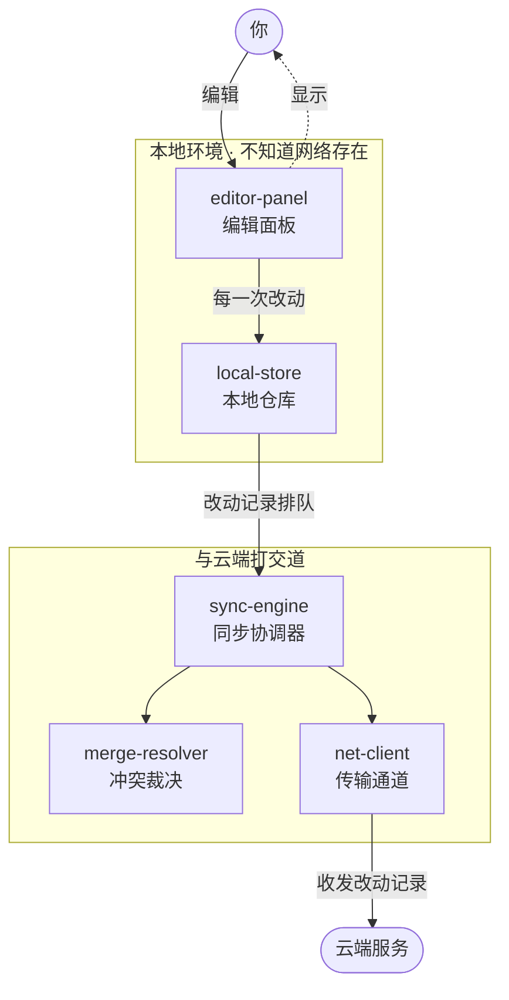
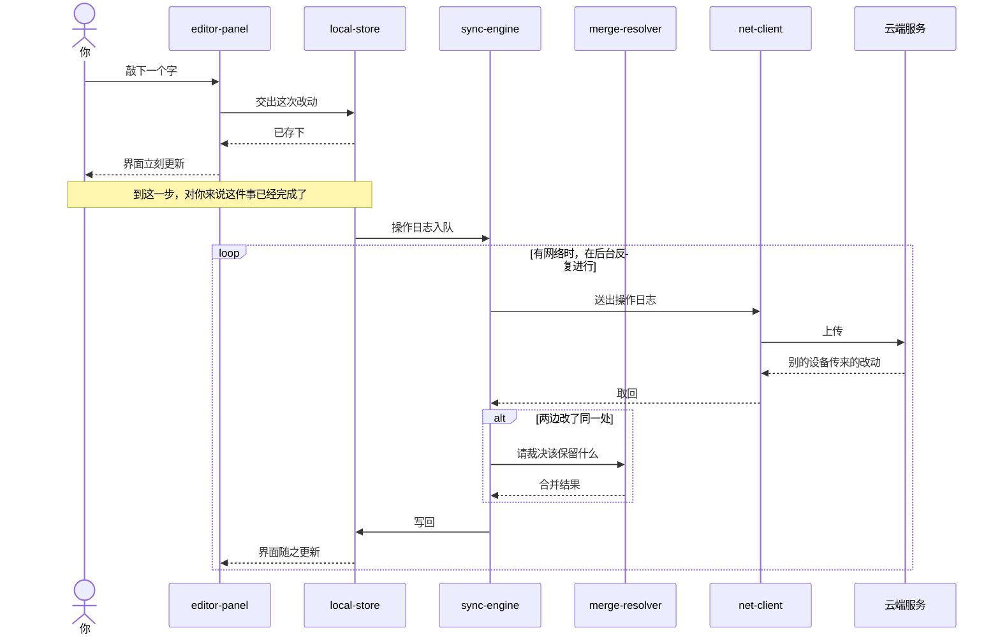

# 示例：导览形态参考（虚构项目）

> **［示例说明］阅读约定**
> - 本文中以`［示例说明］`开头的引用块，是**对规则的解释**，不属于导览内容本身。不要在真实导览里写出这类句子。
> - 其余全部内容是**导览本体**，可以直接当作一份真实导览来读，作为形态参考。
> - **本例中的项目是虚构的**（模块名也是虚构的），仅演示形式。真实导览的一切结论必须来自实际读取，不得套用本例。

> **［示例说明］观察要点**
> - 名称首次出现时**就地绑定**：`真实名称（角色，一句解释）`，此后直接使用，不再绕开、也不另造说法；
> - 宏观结构（本地环境<-->云端服务）是这个项目的特殊事实，不要直接复用；
> - 拓扑用 `flowchart`，交互主线用 `sequenceDiagram`——两种场景各用其所长；
> - 结尾演示了一次向下展开，以及"画不出拓扑即原子"如何处理。

---

# 导览：一个离线优先的笔记应用

## 一、这是什么

一个记笔记的应用。特别之处在于：**断网也照常用**——你写下的每个字都先存在自己机器上、立刻生效，等有网络时它会自动和云端对齐。多台设备改了同一篇笔记，也不会互相覆盖。

## 二、拓扑结构

**宏观结构**：本地环境<-->云端服务。上半部分（`editor-panel`、`local-store`）完全不知道网络的存在；下半部分负责与云端打交道；`sync-engine` 是连接两者的唯一通道。

**值得留意**：`editor-panel` 与 `net-client` 之间没有任何往来。界面永远不会因为网络慢或断网而卡住——"离线优先"这个承诺，正是靠结构上的这处断开兑现的，而不是靠某段代码里的判断。

## 三、交互逻辑

**一次完整的过程**——你敲下一个字之后发生的事：

**逐步讲解**：

1. `editor-panel`（编辑面板，你直接打字的地方）把这次改动交给 `local-store`（本地仓库，应用在你自己机器上的存储）。
2. `local-store` 立刻存下来，界面立刻更新。**到这一步，对你来说这件事已经完成了**——后面的全部发生在背后。
3. 与此同时，`local-store` 把"刚才发生了什么改动"记成一条**操作日志**（oplog，记录"做了什么操作"而非"结果长什么样"），排进队列。
4. `sync-engine`（同步协调器，决定何时同步、同步什么、冲突了找谁裁决）在后台盯着这个队列，有网络时就把记录交给 `net-client`（传输通道，只负责数据的收发）发往云端。
5. 云端也可能有别的设备传来的改动，`net-client` 把它们取回来。
6. 如果两边改了同一处，`sync-engine` 请 `merge-resolver`（冲突裁决，决定该保留什么）决定怎么合并。
7. 合并结果写回 `local-store`，界面随之更新。

**设计优势**

- **写入路径上没有网络。** 你的操作走到 `local-store` 就算数了，网络的事全部发生在那之后。断网可用不是一个附加功能，而是这条路径的自然结果。
- **传的是"发生了什么"，不是"现在是什么样"。** 两台设备各自改了不同段落时，两条操作日志都能保留；如果传的是"最终的样子"，后到的那份会把先到的整个覆盖掉。
- **合并规则被单独隔开。** 怎么算冲突、该保留谁，是这类系统里最容易变、也最容易出错的部分。把它单独作为 `merge-resolver` 一块，换一套规则不波及其他任何地方。
- **`net-client` 不理解内容。** 它只负责送出去和取回来，不关心送的是什么。所以换一种网络方式，同步逻辑一行都不用动。

**易误导概念**：会以为"同步"就是把本地文件上传、把云端文件下载。实际上传的不是文件，而是**一连串操作日志**；云端存的也是这些记录，而不是某个最终版本。多设备不丢东西的根本原因就在这里。

## 四、名称对照表

| 名称                      | 角色       | 说明                                       |
| ------------------------- | ---------- | ------------------------------------------ |
| `editor-panel`            | 编辑面板   | 你直接打字的地方，不参与任何网络行为       |
| `local-store`             | 本地仓库   | 应用在你自己机器上的存储，写入路径的终点   |
| `sync-engine`             | 同步协调器 | 决定何时同步、同步什么、冲突了找谁裁决     |
| `merge-resolver`          | 冲突裁决   | 两边改了同一处时决定该保留什么             |
| `net-client`              | 传输通道   | 只负责数据的收发，不理解内容               |
| 操作日志（oplog）         | 领域术语   | 记录"做了什么操作"，而非"结果长什么样"     |
| 离线优先（offline-first） | 领域术语   | 一种设计取向：本地先成事，网络只做后台协调 |

---

# 向下展开一层：`merge-resolver`

> **［示例说明］** 这一节演示两件事：子节点同样由四部分构成；以及当一块**画不出拓扑**时该怎么处理。

## 一、这是什么

当两台设备改了同一处，它负责决定最终应该是什么样——并且要保证：**不管两边的改动以什么顺序传到、传几次，各台设备最后得到的结果都完全一致。**

## 二、拓扑结构

此部分是一段单一连贯的判断逻辑，没有内部分工，不存在显式拓扑结构。

> **［示例说明］** 这就是"拓扑退化即原子"的落地写法：递归到此结束。相应地，下一节的标题从"交互逻辑"换成了"实现思路"。

## 三、实现思路

思路是：**让每一次改动都自带足够的信息，使得"谁该赢"是一个所有设备都能各自算出同一答案的问题，而不需要谁来当裁判。**

- 每条操作日志都带上"是谁改的、改的是哪个位置"这样的标记（**副本标识与逻辑时钟**，用于给并发改动定序）。
- 两条改动碰在一起时，按一套**所有设备都遵守的固定规则**排出先后——比如按标记的大小排。规则本身不重要，重要的是它对所有设备都一样、且不依赖谁先收到。
- 因此无论改动以什么顺序、重复几次到达，算出来的结果都相同。这就是"最后一定一致"（**收敛性**）的来源。

这一整套做法在领域里有个名字：**无冲突复制数据类型（CRDT）**（让多方各自修改后仍能自动收敛到同一结果的一类算法）。

代价是：结果**一定一致，但不一定符合人的预期**——两个人同时改同一句话，机器只能挑一个赢，它没法理解哪个更有道理。所以这类系统通常还会在别处保留一份历史，让人能翻回去看。

## 四、名称对照表

| 名称                       | 角色     | 说明                                         |
| -------------------------- | -------- | -------------------------------------------- |
| 无冲突复制数据类型（CRDT） | 领域术语 | 让多方各自修改后仍能自动收敛到同一结果的算法 |
| 收敛性                     | 领域术语 | 不同副本独立计算，最终得到相同状态           |
| 交换律与幂等性             | 领域术语 | 换顺序不影响结果；同一条重复应用也不改变结果 |
| 副本标识与逻辑时钟         | 领域术语 | 用于给并发改动定序的标记                     |
